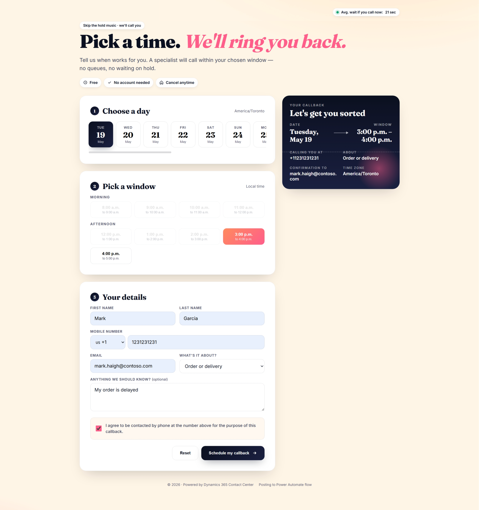
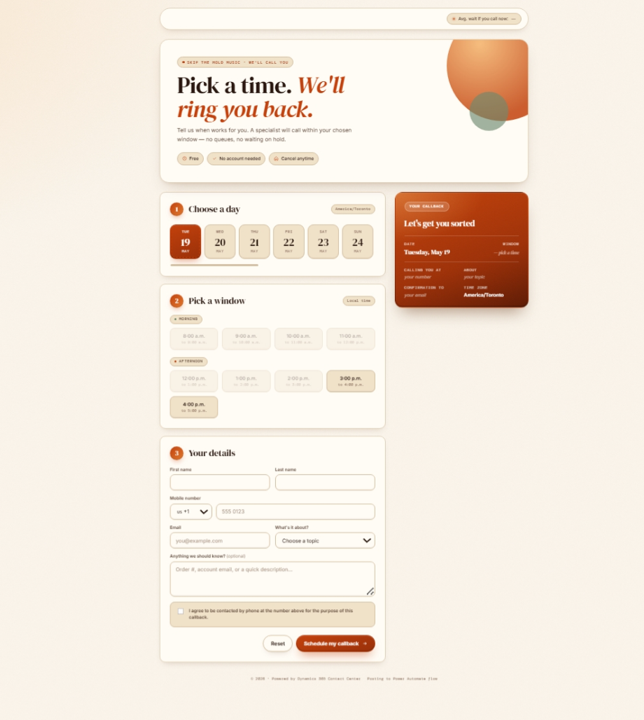
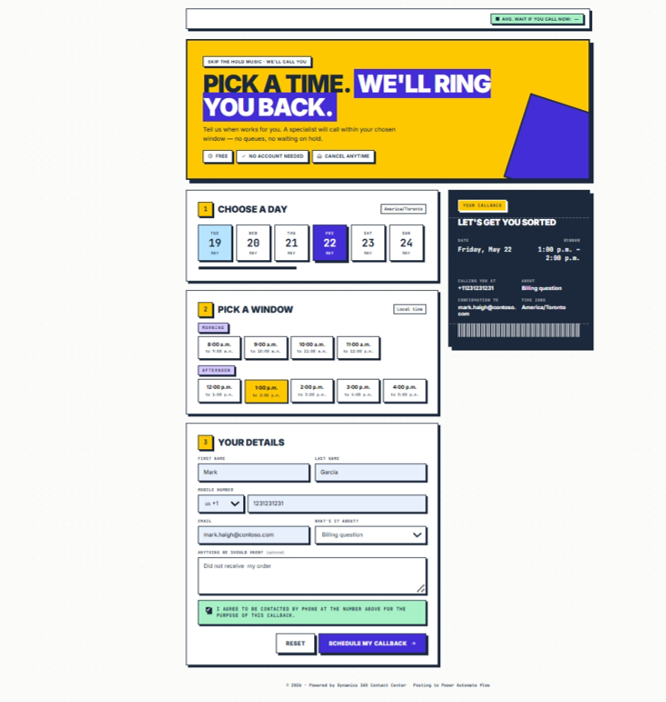
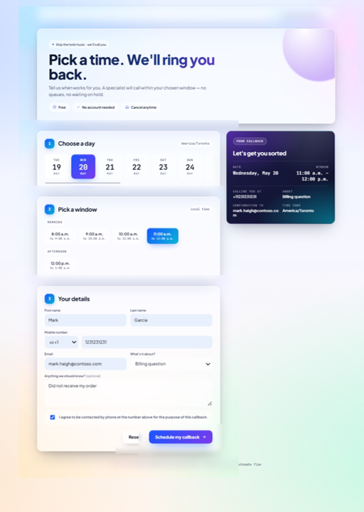
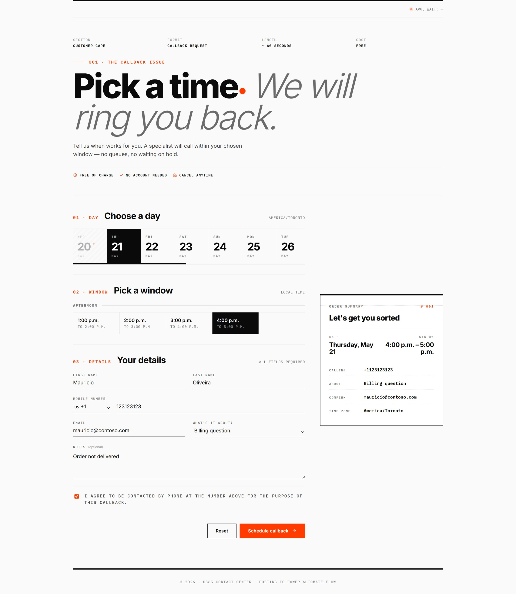
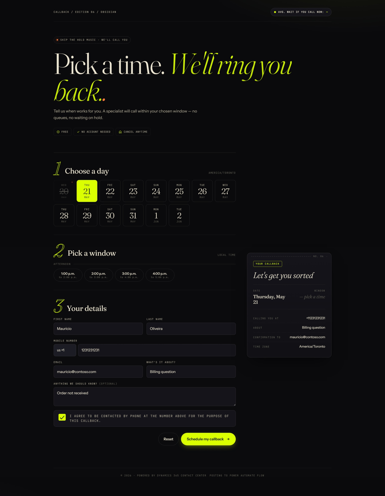
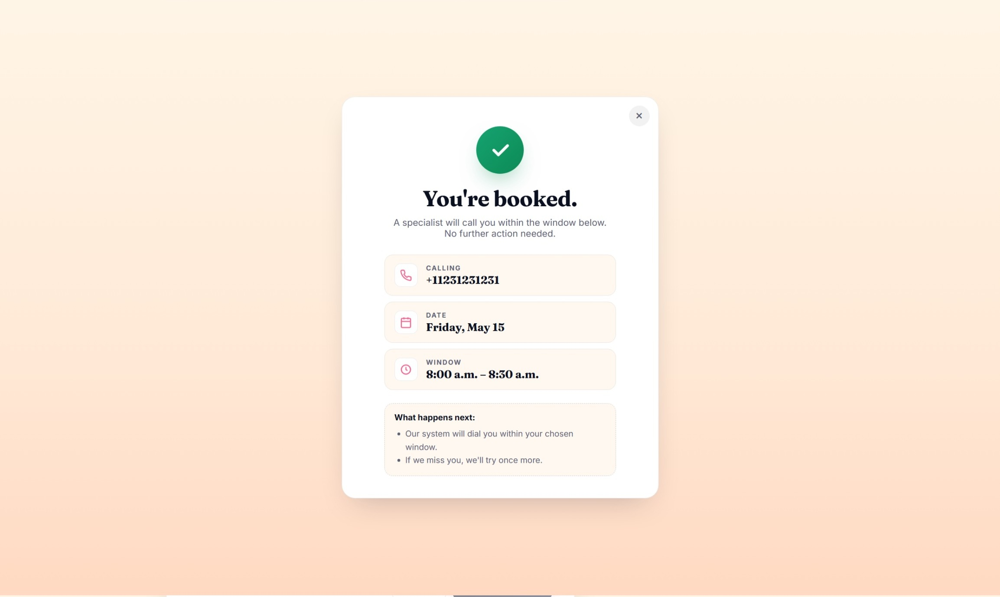
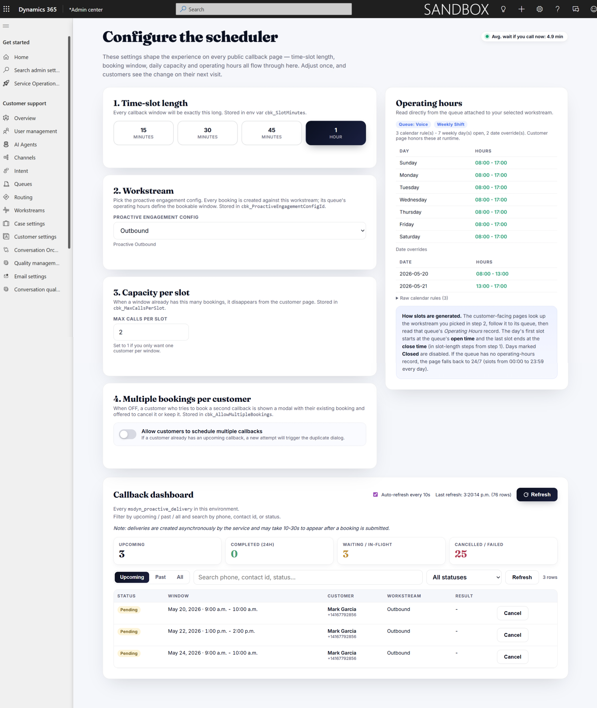

# Callback Scheduler for Dynamics 365 Contact Center

A customer-facing self-service callback booking page for Microsoft Dynamics 365 Contact Center. Customers pick a date and time window, fill in their details, and the system schedules a proactive outbound call — with real-time estimated waiting times shown live on the page. Agents see the callback topic and notes directly on the Active Conversation form when the call connects.

## Choose the look that fits your brand

Six ready-made page layouts ship with the solution. They all do the same thing — book a callback — but each has its own personality. Pick the one that best matches your website, switch between them at any time from the admin page.

<table>
  <tr>
    <td align="center" width="33%"><b>Layout 1 — Classic</b><br/></td>
    <td align="center" width="33%"><b>Layout 2 — Card</b><br/></td>
    <td align="center" width="33%"><b>Layout 3 — Split</b><br/></td>
  </tr>
  <tr>
    <td align="center" width="33%"><b>Layout 4 — Minimal</b><br/></td>
    <td align="center" width="33%"><b>Layout 5 — Bold</b><br/></td>
    <td align="center" width="33%"><b>Layout 6 — Editorial</b><br/></td>
  </tr>
</table>

<p align="center"><i>Try them all and keep the one your customers love most.</i></p>

## Confirmation card

As soon as a customer submits their request, a clean confirmation card appears with the day, time window, phone number, and topic they selected — so they leave the page knowing exactly when to expect the call and what was booked.

<p align="center">
  
</p>

---

## Table of Contents

1. [What It Does](#what-it-does)
2. [The Admin Page](#the-admin-page)
3. [Prerequisites](#prerequisites)
4. [Installation](#installation)
5. [Creating Workstream Context Variables](#creating-workstream-context-variables)
6. [Adding Fields to the Active Conversation Form](#adding-fields-to-the-active-conversation-form)
7. [Topic Options](#topic-options)
8. [Smart Visibility - Business Rules](#smart-visibility---business-rules)
9. [Uninstalling](#uninstalling)

---

## What It Does

The solution deploys a polished booking page as an HTML web resource inside Dynamics 365. Customers can:

- See the **live average waiting time** for a callback, pulled in real time from your environment
- Select a day and time window from a live availability calendar
- Specify what their call is about (loaded dynamically from your topic choices)
- Leave optional notes for the agent

Once submitted, the system:

1. Resolves or creates the customer Contact record in Dataverse
2. Calls `CCaaS_CreateProactiveVoiceDelivery` to schedule the outbound callback
3. A Power Automate flow writes the booking context (topic, notes) to the Conversation record so agents see it immediately when the call connects

**What agents see** when a callback conversation opens:

| Label on Form | Column | Type |
|---|---|---|
| What is it about? | `cbk_whatsitabout_` | Choice |
| Anything we should know? | `maulabs_anythingweshouldknow` | Text |

---

## The Admin Page

Everything about the booking experience — how long each slot is, which workstream handles the calls, how many bookings a single slot can take, and whether customers can book more than once — lives on a single, friendly admin page. Open it once, set things the way you want, and you're done. Changes are picked up by the customer pages on their next refresh.

<p align="center">
  
</p>

### What you can do from the admin page

**1. Time-slot length**
Decide how long each callback window should be — 15, 30, 45 minutes, or a full hour. Shorter slots give customers more choice; longer slots give your agents a bit more breathing room between calls.

**2. Workstream**
Pick which voice workstream handles the callbacks. The page lists every proactive engagement configuration in your environment so you just choose one from the dropdown. The operating hours of the queue attached to that workstream are what customers see as "available days and times" — no extra setup required.

**3. Capacity per slot**
Set the maximum number of bookings allowed in a single time window. Once a slot is full, it disappears from the customer page automatically, so you'll never end up with twenty customers expecting a call at the exact same minute.

**4. Multiple bookings per customer**
A simple on/off switch. When it's off and a customer tries to book a second callback while they already have one scheduled, they see a friendly pop-up showing their existing booking and the choice to either keep it or cancel it and book the new one. When it's on, customers can stack as many bookings as they like.

**5. Operating hours (read-only)**
A quick view of the open/close times for each day of the week, taken straight from the queue you picked in step 2. Edit them in the standard D365 Operating Hours form — the admin page just shows them so you don't have to go hunting.

### The live dashboard

Scroll down on the admin page and you'll find a real-time list of every callback in your environment — past, upcoming, and everything in between.

- **At-a-glance counters** show how many callbacks are upcoming, how many completed in the last 24 hours, how many are waiting, and how many were cancelled or failed.
- **Filter chips** let you flip between *Upcoming*, *Past*, and *All*.
- **Search box** finds bookings by phone number, customer name, or status.
- **Auto-refresh** keeps the list current every 10 seconds — no need to keep hitting reload. There's a manual refresh button too if you're impatient.
- **Cancel button** on each upcoming row lets you call off a booking on a customer's behalf. A confirmation dialog makes sure you don't cancel by accident.
- **Click any row** to jump straight to the underlying conversation record in Dynamics — handy if you want the full history.

> Heads-up: brand-new bookings can take 10–30 seconds to show up in the dashboard. That's the platform writing the record in the background, not the page being slow.

### Who can use it

The admin page is meant for supervisors and administrators. Anyone with the standard **System Administrator** or **Customer Service Manager** role can open it and change settings. Customer-facing pages don't need any of these permissions — they just read the saved settings.

### How to open it

The admin page lives inside the **Customer Service Admin Center** as a menu item — see [Step 3 of the Installation](#step-3---add-the-admin-page-to-customer-service-admin-center) for the one-time setup. Once that's done, opening the page is as easy as clicking a sidebar link.

---

## Prerequisites

Before installing, confirm you have:

- A Dynamics 365 Contact Center (or Customer Service workspace with voice / CCaaS) environment
- **System Administrator** role in the target environment
- A configured **Proactive Engagement Configuration** (voice channel already set up in Omnichannel / CCaaS)
- Power Automate (flows run from the Default environment - no additional license required for D365 customers)

---

## Installation

### Step 1 - Download the solution

1. Go to the [**Releases page**](../../releases/latest) of this repository
2. Download `CallbackScheduler_x_x_x_x_managed.zip` from the **Assets** section

### Step 2 - Import into Dynamics 365

1. Go to [make.powerapps.com](https://make.powerapps.com) and **select your D365 environment** from the top-right environment picker
2. In the left navigation, click **Solutions**
3. Click **Import solution** (top toolbar)
4. Click **Browse**, select the `.zip` you downloaded, then click **Next**
5. Review the solution details and click **Import**
6. Wait for the import to complete (may take 1-3 minutes). A green checkmark confirms success.
7. Click **Publish all customizations** to activate everything

### Step 3 - Add the admin page to Customer Service Admin Center

The admin page needs to live inside an app to work — it relies on the Dynamics host for sign-in, permissions, and the live connection to your data. The cleanest place to put it is as a menu item in the **Customer Service Admin Center**, right where every other contact-center setting lives.

1. Got to [make.powerapps.com](https://make.powerapps.com) &rarr; **Apps** &rarr; **Customer Service Admin Center** &rarr; **Edit &rarr; Edit.
2. In the sitemap editor, pick the area where you want the menu item to appear (a good spot is **Customer support** &rarr; **Workstreams**, so it sits next to the other callback s2ettings)
3. Click **+ New** &rarr; **Subarea**
4. Fill in the panel on the right:
   - **Type**: *Web resource*
   - **URL**: `cbk_callback/setup.html`
   - **Title**: *Callback Scheduler*
   - **Icon**: pick any icon you like (a phone or calendar works well)
5. Click **Save** &rarr; **Publish**

From now on, anyone with admin or supervisor permissions can open the Customer Service Admin Center and click **Callback Scheduler** in the sidebar to manage settings and watch the live dashboard. No URLs to remember, no bookmarks to share.

---

## Creating Workstream Context Variables

The booking page submits the customer's topic and notes as context attributes inside `CCaaS_CreateProactiveVoiceDelivery`. The included Power Automate flow **"CBK - Populate Conversation columns from context"** reads those attributes and writes them to the Conversation record.

For this mapping to work, the matching context variables must exist in the workstream.

### Steps

1. In **Customer Service Admin Center > Workstreams**, open the workstream used for voice callbacks
2. Scroll to the **Context variables** section and click **Add**
3. Create the following two variables exactly as shown:

| Context Variable Name | Type | Description |
|---|---|---|
| `cbk_whatsitabout_` | Number | The option-set integer value of the callback topic |
| `anything_we_should_know` | Text | Free-text notes the customer entered on the booking page |

4. Click **Save**

> **Important:** The variable names must match exactly, including the trailing underscore in `cbk_whatsitabout_`. Dynamics 365 Omnichannel filters out context keys matching certain reserved keywords - the trailing underscore works around this restriction.

---

## Adding Fields to the Active Conversation Form

After installation, add the callback fields to the **Active Conversation** form so agents can see the customer's topic and notes when the call connects.

### Steps

1. Go to [make.powerapps.com](https://make.powerapps.com)
2. Navigate to **Tables > Conversation (`msdyn_ocliveworkitem`) > Forms**
3. Open the **Active Conversation** form (type: **Main**)
4. In the form editor, find a suitable section (or create a new one, e.g. **Callback request**)
5. In the **Table columns** panel on the left, search for and drag these columns onto the form:
   - **What is it about?** (`cbk_whatsitabout_`) - callback topic as a dropdown
   - **Anything we should know?** (`maulabs_anythingweshouldknow`) - customer free-text notes
6. Click **Save** then **Publish**

Example of what agents will see:

| Label | Value |
|---|---|
| What is it about? | Technical support |
| Anything we should know? | My order has not arrived yet |

---

## Topic Options

The "What's it about?" dropdown on the booking page is populated dynamically from the `maulabs_whatsitabout` global Choice (option set). To add, rename, or reorder topics:

1. In [make.powerapps.com](https://make.powerapps.com) > **Solutions**, open **Callback Scheduler for D365 Contact Center**
2. Navigate to **Choices** in the left panel
3. Open **maulabs_whatsitabout**
4. Add or rename options as needed
5. Click **Save** and **Publish**

The booking page reflects changes immediately - it reads option labels live from the Dataverse metadata API.

---

## Smart Visibility - Business Rules

The solution ships with **two business rules** on the **Conversation** table that automatically show or hide the two callback fields based on whether they contain data. This means the form stays clean for every other type of callback your environment already handles.

| Business Rule | Field Watched | Behavior |
|---|---|---|
| `What's it about? - Contains data` | `cbk_whatsitabout_` | Shows the field when populated, hides it when empty |
| `Anything we should know? - Contains data` | `maulabs_anythingweshouldknow` | Shows the field when populated, hides it when empty |

### Why this matters

Dynamics 365 Contact Center already supports several callback patterns out of the box - for example, the system can offer a callback to a customer who has been waiting in queue too long. Those callbacks do **not** carry a topic or customer notes, so the two fields stay empty.

With these business rules in place:

- **Callback scheduled via this booking page** -> fields are populated -> agent sees "What is it about?" and "Anything we should know?" on the Active Conversation form
- **Standard queue-overflow / IVR callback** (or any other callback type) -> fields are empty -> the rules hide them, and the agent sees the form exactly as they did before installing this solution

The solution detects the callback origin automatically based on the data itself - no extra configuration, no separate form, no impact on existing callback flows.

### Activation

The rules are **activated on import**. After you complete the steps in [Adding Fields to the Active Conversation Form](#adding-fields-to-the-active-conversation-form), the smart show/hide behavior takes effect on the next form load.

---
## Uninstalling

1. **Remove the callback fields from the Active Conversation form** (reverse of the steps above) and publish the form
2. In **make.powerapps.com > Solutions**, select **Callback Scheduler for D365 Contact Center**
3. Click **Delete** and confirm

This removes all solution components: web resource, Power Automate flow, columns, and environment variable definitions.

---

## Architecture Overview

```
Customer (booking page in browser or D365 app tab)
        |
        |  CCaaS_CreateProactiveVoiceDelivery (Dataverse action)
        v
D365 CCaaS schedules outbound call within the booked window
        |
        |  call connects, Conversation record is created
        v
Power Automate flow "CBK - Populate Conversation columns from context"
        |
        |  writes topic + notes from workstream context variables
        v
Active Conversation form -> agent sees "What is it about?" + notes
```

---

## Support

For questions or issues, open a GitHub Issue on this repository.
